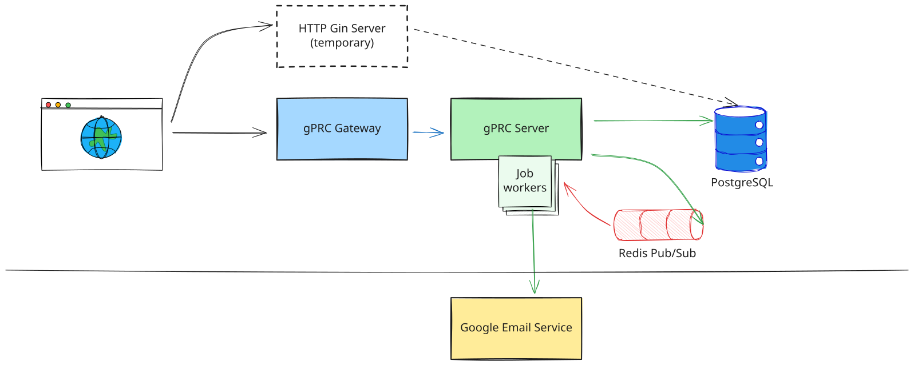
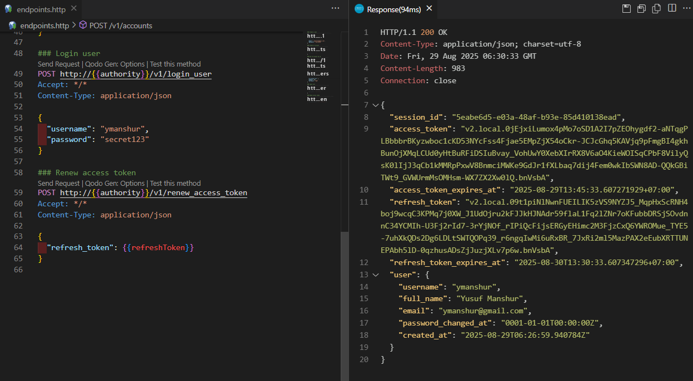

# Simple Bank Service

[](https://github.com/ymanshur/simplebank/actions/workflows/test.yml)

This repo is perhaps the first project I've undertaken outside of my primary professional focus.

I am committed to maintaining this repository as a resource for my professional development in Go. It is my intention that this repository will serve as a valuable asset for anyone seeking to learn how to develop robust software products using Go best practices.

Please let me know if you have any request or probles about this project by create the issue

Thank you for watch!

## About

Simple Bank Service is a comprehensive banking API that provides secure account management, money transfers, and user authentication with email verification.

**Key responsibilities:**

- Create and manage bank accounts, which are composed of owner’s name, balance, and currency.
- Record all balance changes to each of the account. So every time some money is added to or subtracted from the account, an account entry record will be created.
- Perform a money transfer between 2 accounts. This should happen within a transaction, so that either both account's balance are updated successfully or none of them are.
- Handle user registration, authentication, and email verification

TODO features including:

1. Top-up a balance account through a payment gateway such as Midtrans.
2. Release the balance from an account in booking-action schema.

## Architecture Overview

### System Context



### Key Components

- **HTTP API Server (Gin)** - REST endpoints for web clients with JWT authentication
- **gRPC Server** - High-performance API for service-to-service communication
- **gRPC Gateway** - Translates HTTP requests to gRPC calls for unified API access
- **Database Layer (SQLC)** - Type-safe SQL operations with transaction support
- **Background Workers (Asynq)** - Asynchronous email processing and task management
- **Token Management** - Dual support for JWT and PASETO tokens

### Data Flow

1. **Client Request** - HTTP request hits gRPC Gateway or direct gRPC call
2. **Authentication** - Token validation using JWT/PASETO makers
3. **Business Logic** - Request processed through appropriate handler (api/ or gapi/)
4. **Database Operations** - SQLC-generated code executes type-safe SQL queries
5. **Background Tasks** - Email verification and other async tasks queued to Redis
6. **Response** - JSON response returned via HTTP or gRPC protocol

## Project Structure

```bash
simplebank/
├── api/                 # HTTP/REST API handlers (Gin framework)
│   ├── server.go        # HTTP server setup and routing
│   ├── account.go       # Account management endpoints
│   ├── transfer.go      # Money transfer endpoints
│   ├── user.go          # User management endpoints
│   └── middleware.go    # Authentication middleware
├── gapi/                # gRPC API handlers
│   ├── server.go        # gRPC server setup
│   ├── rpc_*.go         # Individual RPC method implementations
│   └── converter.go     # Protocol buffer conversions
├── db/                  # Database layer
│   ├── migration/       # SQL migration files
│   ├── query/           # SQL query definitions
│   ├── sqlc/            # Generated type-safe Go code
│   └── mock/            # Generated mock interfaces
├── pkg/                 # Shared packages
│   ├── token/           # JWT and PASETO token management
│   ├── util/            # Configuration and utilities
│   ├── worker/          # Background task processing
│   └── mail/            # Email sending functionality
├── proto/               # Protocol buffer definitions
├── pb/                  # Generated protobuf Go code
├── docs/                # API documentation and Swagger specs
├── deployment/          # Docker configuration
│   ├── Dockerfile       # Multi-stage build configuration
│   └── start.sh         # Container startup script
├── docker-compose.yaml  # Local development environment
├── Makefile             # Build and development commands
└── main.go              # Application entry point
```

## Technology Stack

### Core Technologies

- **Language:** Go (1.24.6) - Chosen for performance, concurrency, and strong typing
- **HTTP Framework:** Gin - Fast HTTP web framework with middleware support
- **gRPC Framework:** Google gRPC - High-performance RPC framework with Protocol Buffers
- **Database:** PostgreSQL - ACID-compliant relational database for financial data
- **Cache/Queue:** Redis - In-memory store for background task queuing

### Key Libraries

- **SQLC** - Generates type-safe Go code from SQL queries
- **golang-migrate** - Database migration management
- **Asynq** - Distributed task queue for background processing
- **Viper** - Configuration management with environment variable support
- **Zerolog** - Structured logging with JSON output
- **Testify** - Testing toolkit with assertions and mocks

### Development Tools

- **GoMock** - Mock generation for testing
- **Protocol Buffers** - API definition and code generation
- **gRPC Gateway** - HTTP to gRPC translation layer
- **Docker** - Containerization for development and deployment
- **GitHub Actions** - Continuous integration and testing

## Running The Services

1. Clone the repository

    ```bash
    git clone https://github.com/ymanshur/simplebank.git
    ```

2. [Dependencies installation](#dependencies)
3. [Setup infrastructure](#setup-infrastructure)
4. [Run and test your services](#run-your-servies-in-local-machine)

### Dependencies

- [Go](https://golang.org/) v1.23
- [Migrate CLI](https://github.com/golang-migrate/migrate/tree/master/cmd/migrate) is database migrations written in Go

    ```bash
    # Versioned installation
    mkdir -p $GOPATH/src/github.com/golang-migrate
    git clone github.com/golang-migrate/migrate $GOPATH/src/github.com/golang-migrate/
    cd $GOPATH/src/github.com/golang-migrate/migrate/cmd/migrate
    git checkout $TAG  # e.g. v4.15.0

    # Replace the postgres build tag with the appropriate database tag(s) for the databases desired
    go build -tags 'postgres' -ldflags="-X main.Version=$(git describe --tags)" -o $GOPATH/bin/migrate $GOPATH/src/github.com/golang-migrate/migrate/cmd/migrate/
    ```

- [SQL Compiler](https://docs.sqlc.dev/en/latest/overview/install.html) that generates type-safe code from SQL

    ```bash
    go install github.com/sqlc-dev/sqlc/cmd/sqlc@latest

    ```

    for Go version under 1.21

    ```bash
    sudo snap install sqlc
    ```

- [GoMock](https://github.com/golang/mock) is a mocking framework for the Go programming language

    ```bash
    go install github.com/golang/mock/mockgen@v1.6.0
    ```

    Alternatively, use a [maintained fork](https://github.com/uber-go/mock?tab=readme-ov-file#installation) instead

    ```bash
    go install go.uber.org/mock/mockgen@latest
    mockgen -version
    ```

- [DB Docs](https://dbdocs.io/docs) is a simple tool to create web-based documentation for your database.

    ```bash
    npm install -g dbdocs
    dbdocs login
    ```

- [DBML CLI](https://www.dbml.org/cli/#installation)

    DBML (Database Markup Language) is an open-source DSL language designed to define and document database schemas and structures.

    ```bash
    npm install -g @dbml/cli
    ```

    `dbml2sql` is used to convert a DBML file to SQL

    ```bash
    dbml2sql --version
    ```

### Setup infrastructure

Start database PostgreSQL container service:

```bash
make postgres
```

Create `simplebank` database:

```bash
make createdb
```

Run db migration up all versions:

```bash
make migrateup
```

Run db migration down all versions:

```bash
make migratedown
```

### Run your servies in local machine

```bash
make server
```

Test your services:

```bash
make test
```

### Run your servies and the insfrastructures in Docker containers

Complete the necesssary environment variables in the app.env (copy from [app.env.example](/app.env.example)) file.

Following command will run [docker-compose.yaml](docker-compose.yaml) file

```bash
make containes
```

Alternatively, if you already create PostgreSQL dan Redis containers, you just have to run the following command to create only the application container

```bash
make run
```

## Documentation

### Database

Update your database design in [docs/db.dbml](docs/db.dbml) the build DB documentation:

```bash
make dbdocs
```

You can access my DB documentation for this project at [this address](https://dbdocs.io/ymanshur/simplebank)

### OpenAPI

Open <http://localhost:8080/swagger> to see APIs documentation based on gRPC Gateway proto definition, see my own at [this address](https://ymanshur.github.io/simplebank/docs/swagger/)

## Code Generation

Generate schema SQL file with DBML CLI:

```bash
make dbschema
```

Generate SQL CRUD with `sqlc`:

```bash
make sqlc
```

Generate DB mock with GoMock:

```bash
make mock
```

Create a new DB migration:

```bash
make migratecreate name=<migration_name>
```

Generate [protobuf](https://grpc.io/docs/languages/go/quickstart/#regenerate-grpc-code) files and update the [API documentation](#openapi)

```bash
make proto
```

## Tips

### How to hit the endpoint using endpoints.http as a playground

1. Install [REST Client](https://marketplace.visualstudio.com/items?itemName=humao.rest-client) extension
2. To control environment variables add following lines to .vscode/settings.json

    ```json
    "rest-client.environmentVariables": {
        "local": {
            "authority": "localhost:8000",
            "accessToken": "",
            "refreshToken": ""
        },
    },
    ```

3. Copy the returning access and refresh token into environment variables
4. Run the HTTP or Gateway server and follow REST Client documentation to [making request](https://github.com/Huachao/vscode-restclient?tab=readme-ov-file#making-request)

    

### Control Workspace environment variables

Add following line into .vscode/settings.json

```json
{
    "terminal.integrated.env.linux": {
        "POSTGRES_USER": "",
        "POSTGRES_PASSWORD": "",
        "DB_NAME": "simplebank"
    }
}
```
